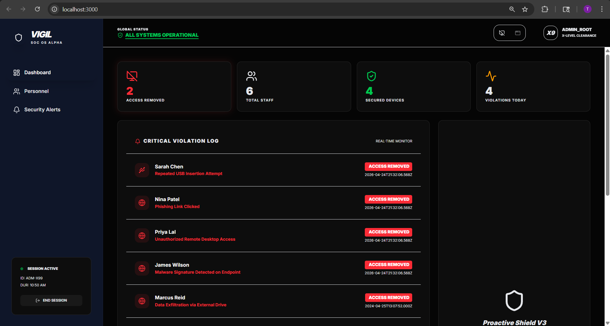
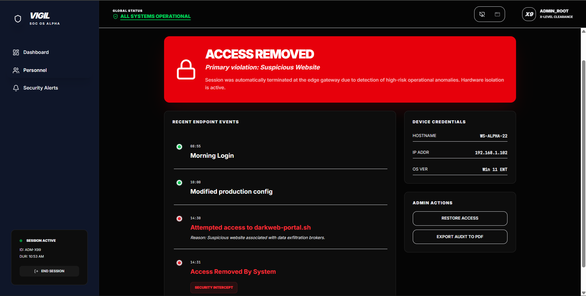
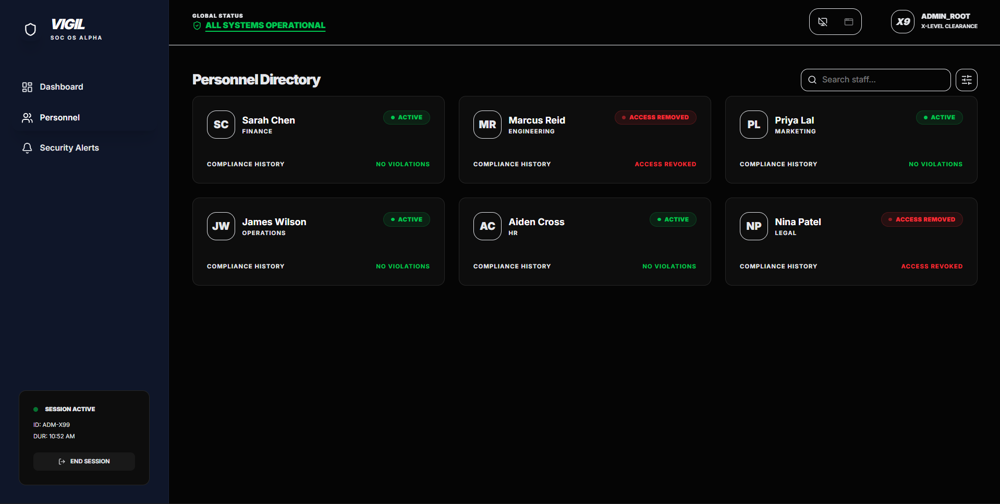
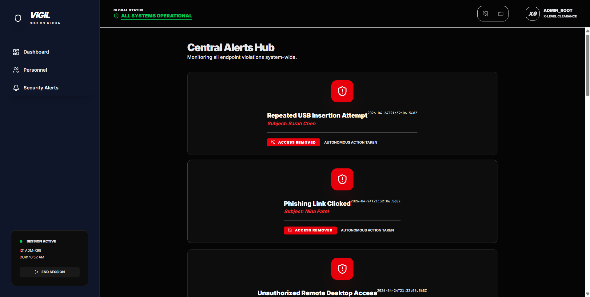

# Vigil – Internal Threat Detection Dashboard

A simple internal dashboard that visualizes suspicious employee activity and enforces basic access revocation.

---

## Screenshots

### Dashboard


### Individual Incident View


### Personnel Directory


### Alerts Hub


---

## Features

- Displays security violations across employees
- Detects:
  - Malicious USB usage
  - Phishing link clicks
  - Unauthorized access attempts
- Automatically marks users as **Access Removed**
- Central alerts dashboard
- Personnel directory with status tracking
- Individual incident timeline view

---

## Tech Stack

- **Frontend:** React (Vite), Tailwind CSS  
- **Backend:** Node.js, Express  

---

## Setup

### Clone the repository

```bash
git clone <https://github.com/THEJAS-BK/Issue_Tracker.git>
cd Alvas_Hackathon_project